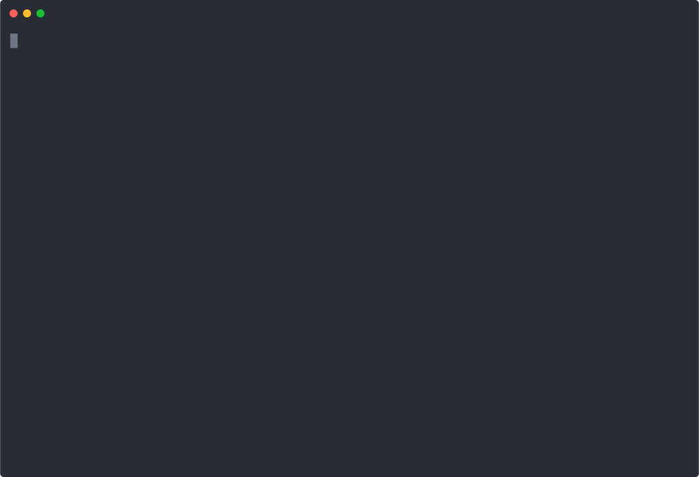

# agentic-compliance-scan

A small open-source CLI that discovers your MCP servers' tools and reports where your agent deployment falls short of the EU AI Act and NIS2, citing the national law that actually binds you (the Italian decree for Italy, the BSIG for Germany), not the directive.

[](https://asciinema.org/a/dX5qSZfSGg001fF8)

You describe what your agent can do, or let the tool discover it. It evaluates a set of declarative rules and prints a gap report where every gap cites a specific legal provision: the AI Act article for the Regulation, and the national transposition for NIS2, never the Directive itself.

## What it does

- Discovers your MCP servers' tools automatically over a `tools/list` handshake and classifies their governance effects into a draft inventory you review. You can also write the inventory by hand, or import a `claude_desktop_config.json` skeleton.
- Evaluates declarative rules against the inventory and produces findings, one per obligation, with the triggering tools listed.
- Derives each finding's severity from the blast radius of the tools involved (admin scope, credentials, write access) and sorts the report by real risk.
- Prints a report in Markdown or JSON, grouped by national law and the EU Regulation, with a severity summary.
- Cites a validated reference for every finding, and marks a citation that is not yet binding (France is a draft bill; Portugal has one article whose effect is deferred).

## What it does not do

It does not monitor, intercept, or enforce anything at runtime. There is no gateway, no web UI, no database, and no account. Discovery does a single `tools/list` handshake to read a server's catalog; it never invokes a tool or watches traffic. Whether your system is high-risk, which systems are in NIS2 scope, and which governance controls you have in place stay human inputs that you set on the draft.

## Install

Requires Node 20 or later and pnpm.

```
git clone <repo-url> agentic-compliance-scan
cd agentic-compliance-scan
pnpm install
pnpm build
```

## Usage

Discover your servers and write a draft inventory to review:

```
node dist/cli.js --discover claude_desktop_config.json --name my-agent > inventory.json
```

Discovery prints progress and review notes to stderr (including any tool whose effects it was unsure about). Review the draft, set `isHighRiskAiSystem`, `inScopeSystems`, and your `controls`, then scan it:

```
node dist/cli.js --inventory inventory.json --jurisdiction IT
node dist/cli.js --inventory inventory.json --jurisdiction FR --format json
```

During development you can skip the build step:

```
pnpm dev -- --inventory inventory.json --jurisdiction BE
```

Jurisdictions covered today: `EU` (AI Act only), and `FR`, `IT`, `PT`, `BE`, `DE` (AI Act plus national NIS2). A `claude_desktop_config.json` lists servers but not their tools or governance properties, so an import gives you a skeleton that you then fill in by hand.

## Inventory format

You do not write the server and tool list by hand. `--discover` generates it for you: the servers, their tools, and a first guess at each tool's effects, with low-confidence guesses flagged for review. Your job on the generated file is the deployment-level part (is it high-risk, what is in NIS2 scope, which controls you have) and correcting any effect the classifier got wrong. You can also write or edit the file by hand. This is its shape:

```json
{
  "deployment": {
    "name": "billing-agent",
    "isHighRiskAiSystem": false,
    "interactsWithPeople": false,
    "generatesSyntheticContent": false,
    "inScopeSystems": ["billing"],
    "controls": {
      "nis2IncidentHandling": true,
      "nis2BusinessContinuity": true
    }
  },
  "servers": [
    {
      "name": "filesystem",
      "transport": "stdio",
      "tools": [
        {
          "name": "write_invoice",
          "effects": {
            "sideEffects": true,
            "externalAccess": false,
            "writes": true,
            "humanInTheLoop": false,
            "scope": ["fs:write"],
            "dataCategories": []
          }
        }
      ]
    }
  ]
}
```

A few fields carry the weight of the analysis:

- `deployment.controls` are the governance controls you declare you have in place, one key per obligation (the ten NIS2 Art. 21(2) measures, NIS2 Art. 20 governance, and the AI Act logging, oversight, and transparency duties). It is optional and every key defaults to false: declare only the controls you have, and a missing one becomes a gap. See `src/schemas/inventory.ts` for the full key list.
- `deployment.isHighRiskAiSystem` gates the AI Act Article 26 rules. Those deployer duties bind only for high-risk AI systems, so they do not fire unless you set this to `true`.
- `deployment.interactsWithPeople` and `deployment.generatesSyntheticContent` gate the AI Act Article 50 transparency rules, which apply regardless of high-risk status.
- `deployment.inScopeSystems` lists the NIS2 in-scope systems the agent acts on. The NIS2 rules apply only when this is non-empty.
- each tool's `effects` describe what the tool can observably do (writes, side effects, external access, the data categories it touches). `--discover` fills these by classifying the tool's name and description, and flags the uncertain ones for you to correct. `humanInTheLoop` stays false here because whether an invocation is approved is a host policy, not something a server reports through `tools/list`.

The zod schemas in `src/schemas/` are the source of truth for the full shape.

## How the rules are sourced

The engine is code; the legal content is data. Every reference lives in `src/rules/data/` with its provenance and a `validated` flag, and no reference is invented by a model: AI Act articles are taken from the official text of Regulation (EU) 2024/1689, and NIS2 national articles from a maintained transposition data set, then checked before they ship.

## Gateway policy recommendations

A gap report tells you which obligations you are missing. `--policy <inventory.json>` goes one step further: for each high-risk tool (admin scope, credentials, write access, or the ability to shut things down), it recommends a policy that restricts it, ranked by blast radius. The output is gateway-agnostic by default: the intent (deny, require approval, or restrict callers), and the fact that the policy has to match on the tool name inside the `tools/call` body, since that is where the tool lives, not in the URL.

```
node dist/cli.js --policy inventory.json
```

Add `--gateway <name>` to also render a product-specific snippet from the same recommendation. Two adapters ship today, and adding one is a single file:

```
node dist/cli.js --policy inventory.json --gateway webmethods
node dist/cli.js --policy inventory.json --gateway envoy
```

This is buildable, not a native feature. No MCP gateway today gates on `params.name` out of the box, so the output is honest about what you would build and points at the coarser native lever (restricting which tools surface by OAuth scope). Only the Streamable HTTP transport works, since each tool call must arrive as a discrete request the gateway can inspect.

## Runtime governance with Varpulis

The scan and the policies are static — a point in time. `--runtime` and `--bridge` add the runtime half: the risky tool-call patterns the static analysis predicts are detected live, on the real MCP traffic, by [Varpulis](https://varpulis-cep.com) (a CEP engine).

`--runtime <inventory.json>` generates a Varpulis VPL ruleset, parameterised from the inventory — a high-blast tool firing, an admin tool called from outside its allowed OAuth scopes, a three-call privilege-escalation sequence, a credential-read-then-exfiltrate sequence, and a destructive burst. The allowed scopes and thresholds come from the same risk model as `--policy`.

```
node dist/cli.js --runtime inventory.json > mcp-governance.vpl
```

`--bridge` is the event side: it reads gateway-captured `tools/call` records as NDJSON on stdin, enriches each with the risk profile the static scan already computed for that tool (admin, credentials, blast radius), and emits Varpulis `McpToolCall` events to a sink. That enrichment is the point — Varpulis does not see raw calls, it sees calls already qualified by the scan, so its rules stay small.

```
# screencast / local varpulis run
node dist/cli.js --bridge inventory.json --sink console < calls.ndjson
# a running deployment: POST to Varpulis's HTTP connector
node dist/cli.js --bridge inventory.json --sink http --target http://localhost:8080/ingest < calls.ndjson
```

Two sinks ship (`console`, `http`); adding Kafka or NATS is one file. The generated VPL is grounded in the verified `varpulis/varpulis` example rules; run it through the `varpulis` CLI against your deployment before relying on it.

This completes the arc: **detect** (scan) → **contain** (gateway policy) → **monitor** (Varpulis runtime).

## Not legal advice

This report is informational. It is not legal advice. Whether a given obligation actually applies to you depends on facts the tool does not know, such as whether your system is in fact high-risk under the AI Act, or whether your entity is in scope under NIS2. Confirm your obligations with qualified counsel.
